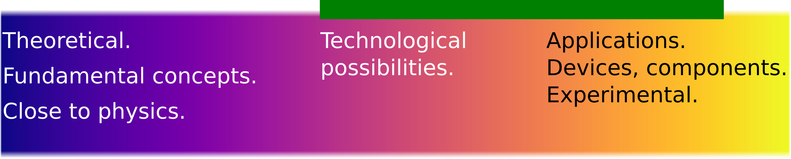
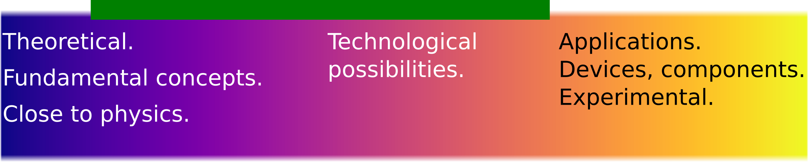

## Microwave-photonics and wave-matter interactions

I am looking for motivated and hardworking students to work with me on interesting and challenging research projects. This page consists of a list of projects in which I am actively looking for students at M.Tech. & M.Tech.+Ph.D. level. Before proceeding to the offered projects, please carefully read the following expectations from prospective students. 

1. At least **40 hours of work per week** is expected after the completion of course work.
2. You will have to **submit one weekly report every week** and **one monthly** report every month. These reports must be in a prescribed format and prepared strictly in **LaTeX only**. 
3. On average there will be one project meeting per week, (based on your weekly report) to discuss the updates. 
	- I commit to give you typed comments and suggestions every week based on your report. 
4. If you don't put in enough sincere efforts, a bad grade is guaranteed in Project evaluation. If your efforts are not up to the expectations after fourth semester, an extension in M.Tech. project is likely, irrespective of your placement status and joining date. However, if you have followed #1 and #2 above, you need not worry. 

_A rough estimate of the time I have invested in setting up this page should give you an indication of my seriousness regarding the project._

----------------------------

## General research interests

If you are still interested, I have a wide spectrum of projects ranging from purely theoretical to purely applied topics. Whether you are fascinated by fundamental concepts or more inclined towards experimental work, there is something on which we may work together. 

My broad research interest lies at the interface of optical physics and communication technologies. I am interested in investigating new fundamental concepts in wave-matter interactions, explore their technologies implications and develop engineering applications. These steps are depicted in the figure below. 

The projects that I am offering lie on the above research spectrum. However, individual projects are generally not spread throughout the spectrum. The **predominant scope** of each project is a subset of the spectrum and is **indicated by a green bar for each project**. Ordering of the projects below is arbitrary. 

----------------------------

## 1. Photonic reconfiguration of microwave devices.

- Preferred specialization: RFME

- Level: M.Tech.

----------------------------

## 2. Full wave EM and circuit modeling of coupled interconnects.

- Preferred specialization: 
	- RFME
	- Students in VLSI can also opt. However, the project predominantly involves microwave theory. 

- Prerequisite: Should have completed _VLSI Interconnects_ course. 

- Level: M.Tech.

----------------------------

## 3. Impedance matching network for coupled interconnects. 

- Preferred specialization: 
	- RFME
	- Students in VLSI can also opt. However, the project predominantly involves electromagnetic wave theory.
	
- Level: M.Tech.

- Prerequisite: Should have completed _VLSI Interconnects_ course. 

----------------------------

## 4. Novel devices based on gyrotropic materials. 

- Preferred specialization: RFME

- Level: M.Tech. 

----------------------------

## 5. Effect of control and read-out lines on realistic microwave QBits. Extraction and tuning of coupling parameters, and its impact on QBit relaxation time. 

- Preferred specialization: RFME

- Level: M.Tech. 

----------------------------

----------------------------

## 6. Iso-frequency-curves(IFC)-governed Cherenkov radiation in complex medium.

- Preferred specialization: RFME

- Level: M.Tech. 

----------------------------

## 7. EM-wave interaction with non-stationary medium.
_EM-wave propagation in time-varying medium, moving medium, space-time modulated medium._

- Preferred specialization: RFME
- Level: M.Tech.; _Possibly M.Tech.+Ph.D._

----------------------------

## 8. Quantum photonics for seamless microwave-to-photonic links.

- Preferred specialization: RFME
- Level: M.Tech.; _Possibly M.Tech.+Ph.D._

-----------------------------

Apart from these, if you have any other ideas in similar areas that you would like to work on, then I am always open for discussions. Just meet me for a discussion. 

